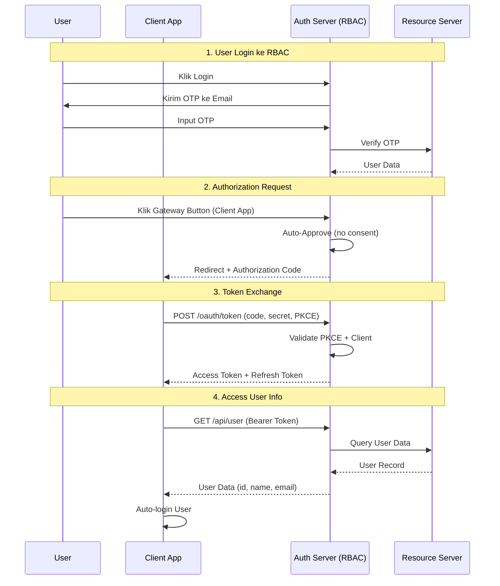

# OAuth 2.0 Flow Diagram - RBAC Livewire Implementation

## Overview

Implementasi OAuth 2.0 Authorization Code Flow dengan PKCE dan Auto-Approval untuk SSO experience.

---

## Flow Diagram (Mermaid)

---

## Key Features

### Sesuai OAuth 2.0 Standard

-   Authorization Code Flow
-   PKCE (S256)
-   State Parameter (CSRF protection)
-   Client Authentication
-   Refresh Token Rotation

### Custom SSO Features

-   Auto-Approval (no consent screen)
-   OTP Login (email-based)
-   Cache-based Token Storage

---

## Endpoints

| Endpoint           | Method | Purpose                  |
| ------------------ | ------ | ------------------------ |
| `/oauth/authorize` | GET    | Authorization request    |
| `/oauth/token`     | POST   | Token exchange & refresh |
| `/api/user`        | GET    | Get user info            |

---

## Notes

-   Auto-approval di step 2 adalah custom feature untuk SSO
-   Refresh token rotation untuk security
-   OTP login sebagai authentication method
